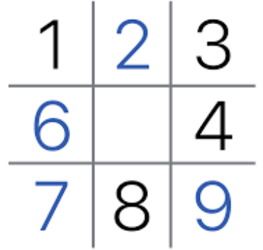
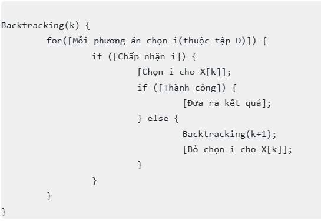

# Sudoku Solver

  
  <h2>Giới thiệu về sudoku</h2>

- Sudoku là một trò chơi giải đố nổi tiếng, với người chơi phải điền các số từ 1 đến 9 vào bảng 9x9 sao cho một số ở mỗi hàng, mỗi cột và mỗi khối 3x3 chỉ xuất hiện một lần duy nhất.
- Khởi đầu của ván sudoku là một bảng 9x9 được chia làm 9 khối, và người chơi sẽ được cung cấp một vài manh mối ngay khi trò chơi bắt đầu. Nhiệm vụ của người chơi là phải hoàn thành tất cả các ô trống còn lại sao cho thỏa mãn luật chơi.
- Nguồn gốc của trò chơi này là từ câu đố "Number Place" của Mỹ, nhưng được công ty Nikoli của Nhật Bản đặt tên và phổ biến rộng rãi trên toàn thế giới và đầu những năm 2000.

  

  
  <h2>Thuật toán giải Sudoku</h2>

<b>Sử dụng thuật toán Backtracking (quay lui)</b>

 - Thuật toán Backtracking được thiết kế dựa trên đệ quy (recursion) được đề ra đầu tiên bởi nhà toán học người Mỹ Derrick Henry "Dick" Lehmer vào những năm 1950. 
 - Bản chất của Backtracking là thuật toán tìm kiếm theo chiều sâu (Depth-first search)
 -
 
<b>Mã giả của thuật toán</b>

  

<h2>Nguồn tham khảo</h2>
https://en.wikipedia.org/wiki/Sudoku_solving_algorithms  
https://www.thegioididong.com/game-app/huong-dan-cach-choi-game-o-so-sudoku-chien-thuat-luat-choi-co-1320525  
https://vncoder.vn/bai-viet/tim-hieu-ve-thuat-toan-quay-lui-backtracking-qua-tro-choi-sudoku  
